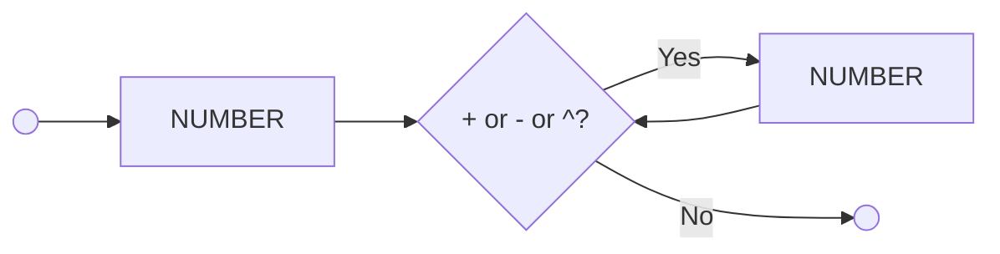

# logcomp-dart-compiler

[](https://compiler-tester.insper-comp.com.br/svg/viniciusgomes2005/logcomp-dart-compiler)

This repository is monitored by Compiler Tester for automatic compilation status.

## Diagrama Sintático



**Descrição:**
- A expressão **inicia** com um `NUMBER` (número inteiro)
- Seguido por **zero ou mais** pares de: `OPERATOR` (+ ou - ou ^) + `NUMBER`
- Termina quando encontra `EOF` (fim da entrada)

**Exemplos válidos:**
- `1+2`
- `3-2`
- `11+22-33`
- `2 ^ 3` (XOR - Extra Credit)
- `789   +345  -    123`

## EBNF:
```ebnf
EXPRESSION = TERM, { ("+" | "-"), TERM } ;
TERM = FACTOR, { ("*" | "/"), FACTOR } ;
FACTOR = ("+" | "-"), FACTOR | "(", EXPRESSION, ")" | NUMBER ;
NUMBER = DIGIT, {DIGIT} ;
DIGIT = 0 | 1 | ... | 9 ;
```