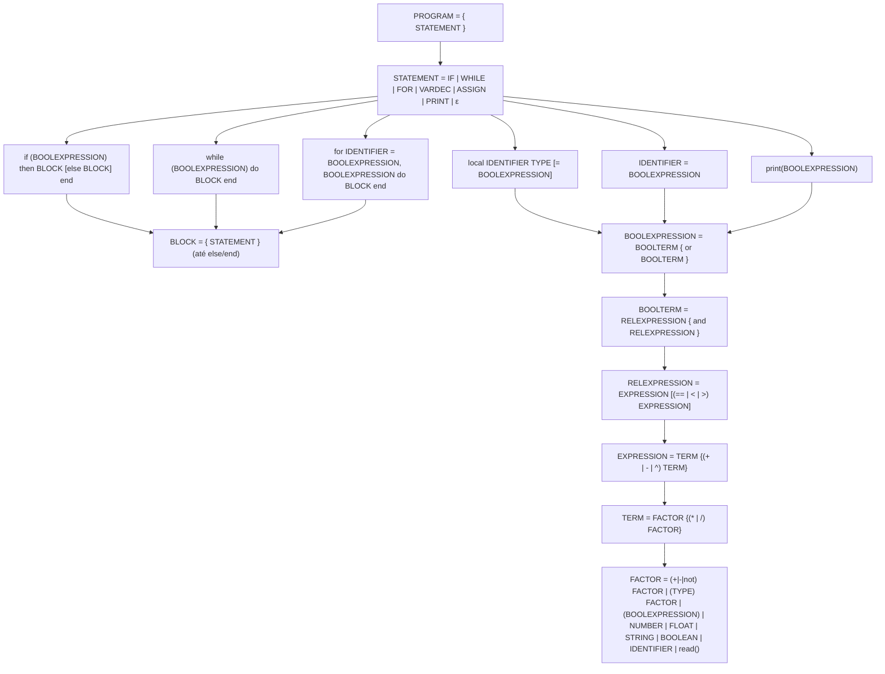

# logcomp-dart-compiler

[](https://compiler-tester.insper-comp.com.br/svg/viniciusgomes2005/logcomp-dart-compiler)

This repository is monitored by Compiler Tester for automatic compilation status.

## Diagrama Sintático


### V2.2 (Roteiro 7)


```mermaid
flowchart TD
  PROGRAM["PROGRAM = { STATEMENT }"]
  STATEMENT["STATEMENT = IF | WHILE | FOR | VARDEC | ASSIGN | PRINT | ε"]
  IFST["if (BOOLEXPRESSION) then BLOCK [else BLOCK] end"]
  WHILEST["while (BOOLEXPRESSION) do BLOCK end"]
  FORST["for IDENTIFIER = BOOLEXPRESSION, BOOLEXPRESSION do BLOCK end"]
  VARDEC["local IDENTIFIER TYPE [= BOOLEXPRESSION]"]
  ASSIGN["IDENTIFIER = BOOLEXPRESSION"]
  PRINT["print(BOOLEXPRESSION)"]
  BLOCK["BLOCK = { STATEMENT } (até else/end)"]
  BEXP["BOOLEXPRESSION = BOOLTERM { or BOOLTERM }"]
  BTERM["BOOLTERM = RELEXPRESSION { and RELEXPRESSION }"]
  REXP["RELEXPRESSION = EXPRESSION [(== | < | >) EXPRESSION]"]
  EXP["EXPRESSION = TERM {(+ | - | ^) TERM}"]
  TERM["TERM = FACTOR {(* | /) FACTOR}"]
  FACTOR["FACTOR = (+|-|not) FACTOR | (TYPE) FACTOR | (BOOLEXPRESSION) | NUMBER | FLOAT | STRING | BOOLEAN | IDENTIFIER | read()"]

  PROGRAM --> STATEMENT
  STATEMENT --> IFST
  STATEMENT --> WHILEST
  STATEMENT --> FORST
  STATEMENT --> VARDEC
  STATEMENT --> ASSIGN
  STATEMENT --> PRINT
  IFST --> BLOCK
  WHILEST --> BLOCK
  FORST --> BLOCK
  VARDEC --> BEXP
  ASSIGN --> BEXP
  PRINT --> BEXP
  BEXP --> BTERM
  BTERM --> REXP
  REXP --> EXP
  EXP --> TERM
  TERM --> FACTOR
```

## EBNF:
```ebnf
PROGRAM = { STATEMENT } ;
STATEMENT = (
    VARDEC
  | ASSIGN
  | IFSTMT
  | WHILESTMT
  | FORSTMT
  | PRINTSTMT
  | ε
), EOL ;
VARDEC = "local", IDENTIFIER, TYPE, ["=", BOOLEXPRESSION] ;
ASSIGN = IDENTIFIER, "=", BOOLEXPRESSION ;
IFSTMT = "if", "(", BOOLEXPRESSION, ")", "then", EOL, BLOCK, ["else", EOL, BLOCK], "end" ;
WHILESTMT = "while", "(", BOOLEXPRESSION, ")", "do", EOL, BLOCK, "end" ;
FORSTMT = "for", IDENTIFIER, "=", BOOLEXPRESSION, ",", BOOLEXPRESSION, "do", EOL, BLOCK, "end" ;
PRINTSTMT = "print", "(", BOOLEXPRESSION, ")" ;
BLOCK = { STATEMENT } ;
BOOLEXPRESSION = BOOLTERM, { "||", BOOLTERM } ;
BOOLTERM = RELEXPRESSION, { "&&", RELEXPRESSION } ;
RELEXPRESSION = EXPRESSION, [("==" | "<" | ">"), EXPRESSION] ;
EXPRESSION = TERM, { ("+" | "-" | "^"), TERM } ;
TERM = FACTOR, { ("*" | "/"), FACTOR } ;
FACTOR = ("+" | "-" | "not"), FACTOR
       | "(", TYPE, ")", FACTOR
       | "(", BOOLEXPRESSION, ")"
       | NUMBER
       | FLOAT
       | STRING
       | BOOLEAN
       | IDENTIFIER
       | READ, "(", ")" ;
TYPE = "number" | "float" | "boolean" | "string" ;
BOOLEAN = "true" | "false" ;
STRING = "\"", { CHAR }, "\"" ;
NUMBER = DIGIT, { DIGIT } ;
FLOAT = DIGIT, { DIGIT }, ".", DIGIT, { DIGIT } ;
DIGIT = 0 | 1 | ... | 9 ;
IDENTIFIER = LETTER, {LETTER | DIGIT | "_"} ;
LETTER = a | b | ... | z | A | B | ... | Z ;
```

## Base de Testes (Roteiro 7)

- `teste_roteiro7_ok.lua`: usa `string`, `number`, `boolean`, `float`, concatenação, `if`, `while` e cast.
- `teste_roteiro7_legacy.lua`: garante funcionamento de estruturas antigas (if/while/and/or/not/aritmética).
- `teste_roteiro7_tipo_incorreto.lua`: valida erro de tipo.
- `teste_roteiro7_if_string.lua`: valida erro de uso de string como condição de `if`.
- `teste_roteiro7_while_string.lua`: valida erro de uso de string como condição de `while`.
