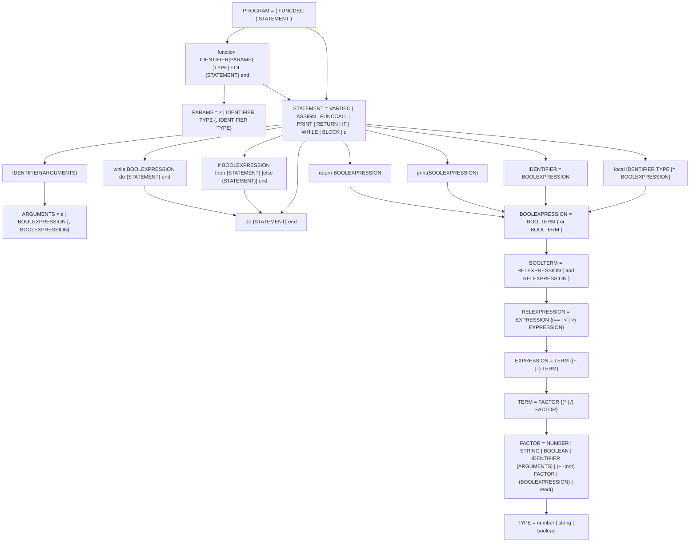

# logcomp-dart-compiler

[](https://compiler-tester.insper-comp.com.br/svg/viniciusgomes2005/logcomp-dart-compiler)

This repository is monitored by Compiler Tester for automatic compilation status.

## Diagrama Sintático

### V3.0 (Funções e Escopo)


```mermaid
flowchart TD
  PROGRAM["PROGRAM = { FUNCDEC | STATEMENT }"]
  FUNCDEC["function IDENTIFIER(PARAMS) [TYPE] EOL {STATEMENT} end"]
  PARAMS["PARAMS = ε | IDENTIFIER TYPE {, IDENTIFIER TYPE}"]
  STATEMENT["STATEMENT = VARDEC | ASSIGN | FUNCCALL | PRINT | RETURN | IF | WHILE | BLOCK | ε"]
  VARDEC["local IDENTIFIER TYPE [= BOOLEXPRESSION]"]
  ASSIGN["IDENTIFIER = BOOLEXPRESSION"]
  FUNCCALL["IDENTIFIER(ARGUMENTS)"]
  ARGUMENTS["ARGUMENTS = ε | BOOLEXPRESSION {, BOOLEXPRESSION}"]
  PRINT["print(BOOLEXPRESSION)"]
  RETURN["return BOOLEXPRESSION"]
  IFST["if BOOLEXPRESSION then {STATEMENT} [else {STATEMENT}] end"]
  WHILEST["while BOOLEXPRESSION do {STATEMENT} end"]
  BLOCK["do {STATEMENT} end"]
  BEXP["BOOLEXPRESSION = BOOLTERM { or BOOLTERM }"]
  BTERM["BOOLTERM = RELEXPRESSION { and RELEXPRESSION }"]
  REXP["RELEXPRESSION = EXPRESSION {(== | < | >) EXPRESSION}"]
  EXP["EXPRESSION = TERM {(+ | -) TERM}"]
  TERM["TERM = FACTOR {(* | /) FACTOR}"]
  FACTOR["FACTOR = NUMBER | STRING | BOOLEAN | IDENTIFIER [ARGUMENTS] | (+|-|not) FACTOR | (BOOLEXPRESSION) | read()"]
  TYPE["TYPE = number | string | boolean"]

  PROGRAM --> FUNCDEC
  PROGRAM --> STATEMENT
  FUNCDEC --> PARAMS
  FUNCDEC --> STATEMENT
  STATEMENT --> IFST
  STATEMENT --> WHILEST
  STATEMENT --> BLOCK
  STATEMENT --> VARDEC
  STATEMENT --> ASSIGN
  STATEMENT --> FUNCCALL
  STATEMENT --> PRINT
  STATEMENT --> RETURN
  FUNCCALL --> ARGUMENTS
  IFST --> BLOCK
  WHILEST --> BLOCK
  VARDEC --> BEXP
  ASSIGN --> BEXP
  PRINT --> BEXP
  RETURN --> BEXP
  BEXP --> BTERM
  BTERM --> REXP
  REXP --> EXP
  EXP --> TERM
  TERM --> FACTOR
  FACTOR --> TYPE
```

## EBNF:
```ebnf
PROGRAM = { FUNCDEC | STATEMENT } ;
FUNCDEC = "function", IDENTIFIER, "(", ( | IDENTIFIER, TYPE, { ",", IDENTIFIER, TYPE } ), ")", ( TYPE | ), "\n", { STATEMENT }, "end" ;
BLOCK = "do", {STATEMENT, }, "end" ;
STATEMENT = ( | "local", IDENTIFIER, TYPE, ( | "=", BOOLEXPRESSION ) | ( IDENTIFIER, ( "=",
BOOLEXPRESSION | "(", ( BOOLEXPRESSION, { ",", BOOLEXPRESSION } | ), ")" ) ) | ( "print", "(",
BOOLEXPRESSION, ")" ) | "return", BOOLEXPRESSION | ), "\n" | ( "if", BOOLEXPRESSION, "then",
{ STATEMENT }, ( | "else", { STATEMENT } ) ), "end" | ( "while", BOOLEXPRESSION, "do",
{ STATEMENT }, "end" ) | BLOCK ;
BOOLEXPRESSION = BOOLTERM, { "or", BOOLTERM } ;
BOOLTERM = RELEXPRESSION, { "and", RELEXPRESSION } ;
RELEXPRESSION = EXPRESSION, { ( "==" | "<" | ">" ), EXPRESSION };
EXPRESSION = TERM, { ("+" | "-"), TERM } ;
TERM = FACTOR, { ("*" | "/"), FACTOR } ;
FACTOR = NUMBER | STRING | BOOLEAN | IDENTIFIER, ( "(", ( BOOLEXPRESSION, { ",", BOOLEXPRESSION } | ), ")" | ) | ( "+" | "-" | "not" ), FACTOR | "(", BOOLEXPRESSION, ")" | "read", "(", ")" ;
TYPE = "number" | "string" | "boolean" ;
NUMBER = DIGIT, {DIGIT} ;
IDENTIFIER = LETTER, {LETTER | DIGIT | "_"} ;
STRING = '"..."' ;
DIGIT = "0" | "..." | "9";
LETTER = "a" | "..." | "z" | "A" | "..." | "Z" ;
BOOLEAN = "true" | "false" ;
```

## Base de Testes (Roteiro 7)

- `teste_roteiro7_ok.lua`: usa `string`, `number`, `boolean`, `float`, concatenação, `if`, `while` e cast.
- `teste_roteiro7_legacy.lua`: garante funcionamento de estruturas antigas (if/while/and/or/not/aritmética).
- `teste_roteiro7_tipo_incorreto.lua`: valida erro de tipo.
- `teste_roteiro7_if_string.lua`: valida erro de uso de string como condição de `if`.
- `teste_roteiro7_while_string.lua`: valida erro de uso de string como condição de `while`.

## Base de Testes (Funções e Escopo)

- `teste_roteiro8_funcoes_ok.lua`: valida declaração de função, chamada, retorno e sombra de variável em `do/end`.
- `teste_roteiro8_recursao.lua`: valida função recursiva (`fat(5)` imprime `120`).
- `teste_roteiro8_erro_argumentos.lua`: valida chamada com quantidade incorreta de argumentos.
- `teste_roteiro8_erro_tipo_argumento.lua`: valida tipo incorreto em argumento.
- `teste_roteiro8_erro_funcao_inexistente.lua`: valida chamada de função não declarada.
- `teste_roteiro8_erro_escopo.lua`: valida uso de variável fora do escopo.

## Sugestões de Testes Adicionais

- Função com retorno declarado que não executa `return`.
- Função sem tipo de retorno tentando retornar valor.
- Função declarada dentro de outra função ou bloco, que deve gerar erro de parser.
- Variável local com mesmo nome de variável global e atribuições em ambos os escopos.
- `return` dentro de `if` e `while`, para validar propagação do retorno pelo bloco.

## Questionário

Classes poderiam reutilizar a ideia de `struct` como molde, adicionando uma tabela de métodos por tipo e uma referência opcional para superclasse. A instanciação criaria um objeto com uma `SymbolTable` própria para atributos; chamadas como `obj.metodo()` passariam o próprio objeto como contexto implícito (`self`) e o verificador garantiria existência e tipos de atributos/métodos.

Partial application pode ser implementada permitindo que `FuncCall` receba menos argumentos que a assinatura e retorne um valor de tipo função contendo a referência da função original mais os argumentos já vinculados. Uma chamada posterior completaria a lista, validaria tipos restantes e executaria normalmente.

Otimizações simples durante a análise sintática incluem constant folding (`2 + 3` vira `5`), eliminação de operações neutras (`x + 0`, `x * 1`), simplificação booleana (`true and x` vira `x`) e remoção de blocos inalcançáveis após `return`. Peephole optimization costuma atuar em uma janela pequena de instruções já geradas, por exemplo removendo `push` seguido de `pop` equivalente ou trocando sequências redundantes por uma instrução mais direta.
