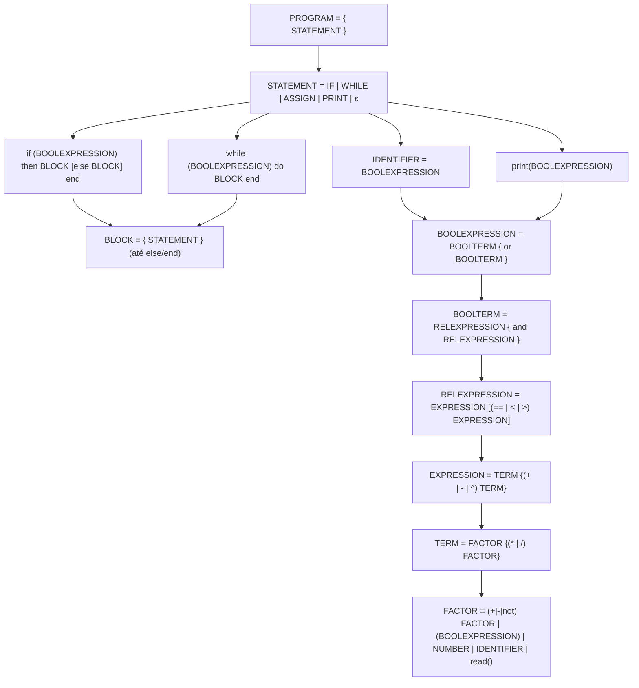

# logcomp-dart-compiler

[](https://compiler-tester.insper-comp.com.br/svg/viniciusgomes2005/logcomp-dart-compiler)

This repository is monitored by Compiler Tester for automatic compilation status.

## Diagrama Sintático


### V2.1 (Roteiro 6)


```mermaid
flowchart TD
  PROGRAM["PROGRAM = { STATEMENT }"]
  STATEMENT["STATEMENT = IF | WHILE | ASSIGN | PRINT | ε"]
  IFST["if (BOOLEXPRESSION) then BLOCK [else BLOCK] end"]
  WHILEST["while (BOOLEXPRESSION) do BLOCK end"]
  ASSIGN["IDENTIFIER = BOOLEXPRESSION"]
  PRINT["print(BOOLEXPRESSION)"]
  BLOCK["BLOCK = { STATEMENT } (até else/end)"]
  BEXP["BOOLEXPRESSION = BOOLTERM { or BOOLTERM }"]
  BTERM["BOOLTERM = RELEXPRESSION { and RELEXPRESSION }"]
  REXP["RELEXPRESSION = EXPRESSION [(== | < | >) EXPRESSION]"]
  EXP["EXPRESSION = TERM {(+ | - | ^) TERM}"]
  TERM["TERM = FACTOR {(* | /) FACTOR}"]
  FACTOR["FACTOR = (+|-|not) FACTOR | (BOOLEXPRESSION) | NUMBER | IDENTIFIER | read()"]

  PROGRAM --> STATEMENT
  STATEMENT --> IFST
  STATEMENT --> WHILEST
  STATEMENT --> ASSIGN
  STATEMENT --> PRINT
  IFST --> BLOCK
  WHILEST --> BLOCK
  ASSIGN --> BEXP
  PRINT --> BEXP
  BEXP --> BTERM
  BTERM --> REXP
  REXP --> EXP
  EXP --> TERM
  TERM --> FACTOR
```

## EBNF:
```ebnf
PROGRAM = { STATEMENT } ;
STATEMENT = ((IF, "(", BOOLEXPRESSION, ")", THEN, EOL, BLOCK, ((ELSE, EOL, BLOCK) | ε), END) | (WHILE, "(", BOOLEXPRESSION, ")", DO, EOL, BLOCK, END) | (IDENTIFIER, "=", BOOLEXPRESSION) | (PRINT, "(", BOOLEXPRESSION, ")") | ε), EOL ;
BLOCK = { STATEMENT } ;
BOOLEXPRESSION = BOOLTERM, { ("or" | "||"), BOOLTERM } ;
BOOLTERM = RELEXPRESSION, { ("and" | "&&"), RELEXPRESSION } ;
RELEXPRESSION = EXPRESSION, [("==" | "<" | ">"), EXPRESSION] ;
EXPRESSION = TERM, { ("+" | "-" | "^"), TERM } ;
TERM = FACTOR, { ("*" | "/"), FACTOR } ;
FACTOR = ("+" | "-" | "not"), FACTOR | "(", BOOLEXPRESSION, ")" | NUMBER | IDENTIFIER | READ, "(", ")" ;
NUMBER = DIGIT, {DIGIT} ;
DIGIT = 0 | 1 | ... | 9 ;
IDENTIFIER = LETTER, {LETTER | DIGIT | "_"} ;
LETTER = a | b | ... | z | A | B | ... | Z ;
```

## Base de Testes (Roteiro 6)

Arquivo: `teste_roteiro6.lua`
