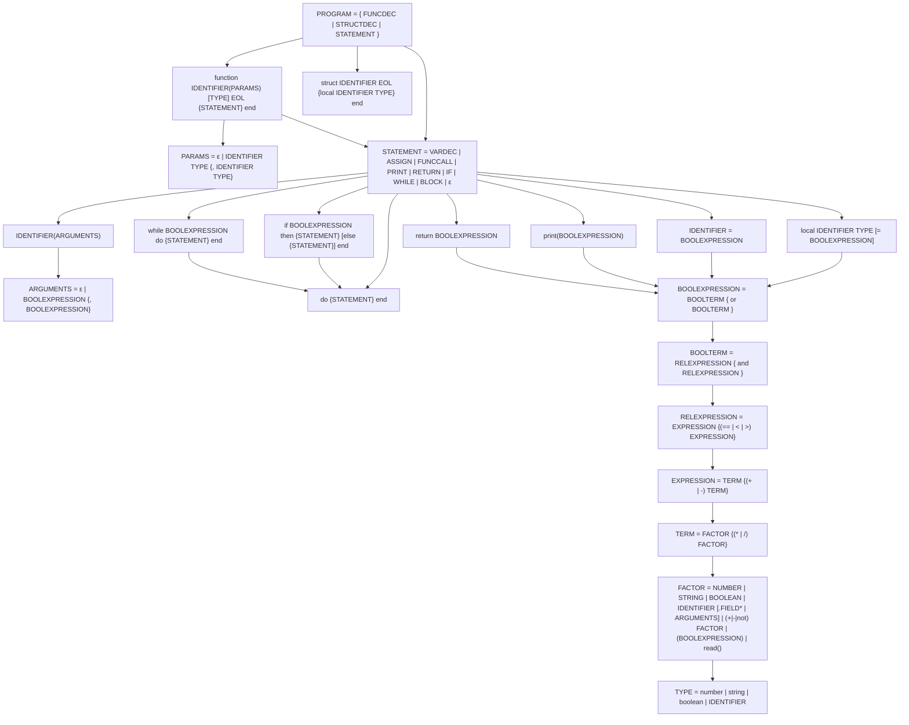

# logcomp-dart-compiler

[](https://compiler-tester.insper-comp.com.br/svg/viniciusgomes2005/logcomp-dart-compiler)

This repository is monitored by Compiler Tester for automatic compilation status.

## Diagrama Sintático

### V3.0 (Funções e Escopo)


```mermaid
flowchart TD
  PROGRAM["PROGRAM = { FUNCDEC | STRUCTDEC | STATEMENT }"]
  FUNCDEC["function IDENTIFIER(PARAMS) [TYPE] EOL {STATEMENT} end"]
  STRUCTDEC["struct IDENTIFIER EOL {local IDENTIFIER TYPE} end"]
  PARAMS["PARAMS = ε | IDENTIFIER TYPE {, IDENTIFIER TYPE}"]
  STATEMENT["STATEMENT = VARDEC | ASSIGN | FUNCCALL | PRINT | RETURN | IF | WHILE | BLOCK | ε"]
  VARDEC["local IDENTIFIER TYPE [= BOOLEXPRESSION]"]
  ASSIGN["IDENTIFIER = BOOLEXPRESSION"]
  FUNCCALL["IDENTIFIER(ARGUMENTS)"]
  ARGUMENTS["ARGUMENTS = ε | BOOLEXPRESSION {, BOOLEXPRESSION}"]
  PRINT["print(BOOLEXPRESSION)"]
  RETURN["return BOOLEXPRESSION"]
  IFST["if BOOLEXPRESSION then {STATEMENT} [else {STATEMENT}] end"]
  WHILEST["while BOOLEXPRESSION do {STATEMENT} end"]
  BLOCK["do {STATEMENT} end"]
  BEXP["BOOLEXPRESSION = BOOLTERM { or BOOLTERM }"]
  BTERM["BOOLTERM = RELEXPRESSION { and RELEXPRESSION }"]
  REXP["RELEXPRESSION = EXPRESSION {(== | < | >) EXPRESSION}"]
  EXP["EXPRESSION = TERM {(+ | -) TERM}"]
  TERM["TERM = FACTOR {(* | /) FACTOR}"]
  FACTOR["FACTOR = NUMBER | STRING | BOOLEAN | IDENTIFIER [.FIELD* | ARGUMENTS] | (+|-|not) FACTOR | (BOOLEXPRESSION) | read()"]
  TYPE["TYPE = number | string | boolean | IDENTIFIER"]

  PROGRAM --> FUNCDEC
  PROGRAM --> STRUCTDEC
  PROGRAM --> STATEMENT
  FUNCDEC --> PARAMS
  FUNCDEC --> STATEMENT
  STATEMENT --> IFST
  STATEMENT --> WHILEST
  STATEMENT --> BLOCK
  STATEMENT --> VARDEC
  STATEMENT --> ASSIGN
  STATEMENT --> FUNCCALL
  STATEMENT --> PRINT
  STATEMENT --> RETURN
  FUNCCALL --> ARGUMENTS
  IFST --> BLOCK
  WHILEST --> BLOCK
  VARDEC --> BEXP
  ASSIGN --> BEXP
  PRINT --> BEXP
  RETURN --> BEXP
  BEXP --> BTERM
  BTERM --> REXP
  REXP --> EXP
  EXP --> TERM
  TERM --> FACTOR
  FACTOR --> TYPE
```

## EBNF:
```ebnf
PROGRAM = { FUNCDEC | STRUCTDEC | STATEMENT } ;
FUNCDEC = "function", IDENTIFIER, "(", ( | IDENTIFIER, TYPE, { ",", IDENTIFIER, TYPE } ), ")", ( TYPE | ), "\n", { STATEMENT }, "end" ;
STRUCTDEC = "struct", IDENTIFIER, "\n", { "local", IDENTIFIER, TYPE, "\n" }, "end" ;
BLOCK = "do", {STATEMENT, }, "end" ;
STATEMENT = ( | "local", IDENTIFIER, TYPE, ( | "=", BOOLEXPRESSION ) | ( IDENTIFIER, ( "=",
BOOLEXPRESSION | ".", IDENTIFIER, { ".", IDENTIFIER }, "=", BOOLEXPRESSION | "(", ( BOOLEXPRESSION, { ",", BOOLEXPRESSION } | ), ")" ) ) | ( "print", "(",
BOOLEXPRESSION, ")" ) | "return", BOOLEXPRESSION | ), "\n" | ( "if", BOOLEXPRESSION, "then",
{ STATEMENT }, ( | "else", { STATEMENT } ) ), "end" | ( "while", BOOLEXPRESSION, "do",
{ STATEMENT }, "end" ) | BLOCK ;
BOOLEXPRESSION = BOOLTERM, { "or", BOOLTERM } ;
BOOLTERM = RELEXPRESSION, { "and", RELEXPRESSION } ;
RELEXPRESSION = EXPRESSION, { ( "==" | "<" | ">" ), EXPRESSION };
EXPRESSION = TERM, { ("+" | "-"), TERM } ;
TERM = FACTOR, { ("*" | "/"), FACTOR } ;
FACTOR = NUMBER | STRING | BOOLEAN | IDENTIFIER, ( ".", IDENTIFIER, { ".", IDENTIFIER } | "(", ( BOOLEXPRESSION, { ",", BOOLEXPRESSION } | ), ")" | ) | ( "+" | "-" | "not" ), FACTOR | "(", BOOLEXPRESSION, ")" | "read", "(", ")" ;
TYPE = "number" | "string" | "boolean" | IDENTIFIER ;
NUMBER = DIGIT, {DIGIT} ;
IDENTIFIER = LETTER, {LETTER | DIGIT | "_"} ;
STRING = '"..."' ;
DIGIT = "0" | "..." | "9";
LETTER = "a" | "..." | "z" | "A" | "..." | "Z" ;
BOOLEAN = "true" | "false" ;
```